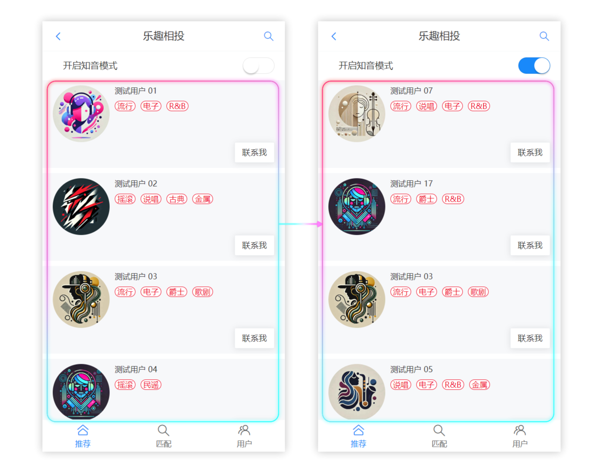
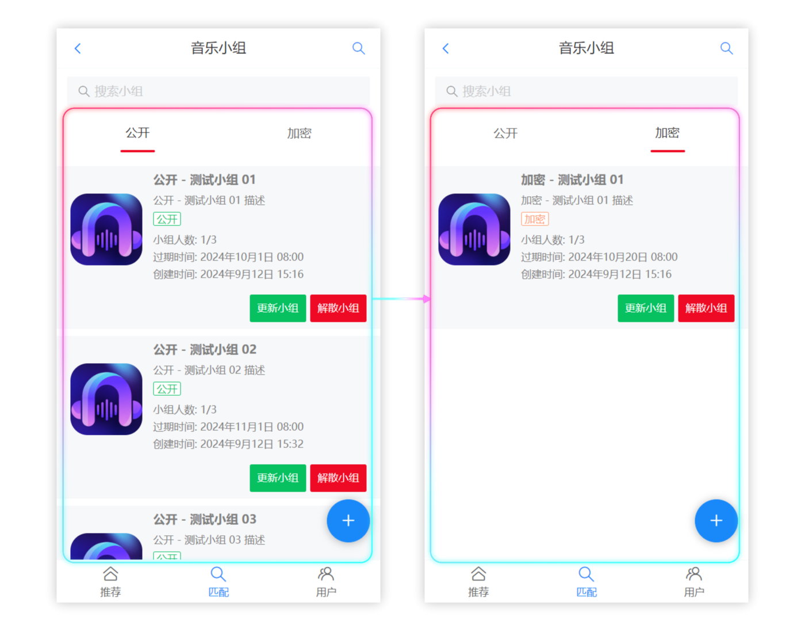
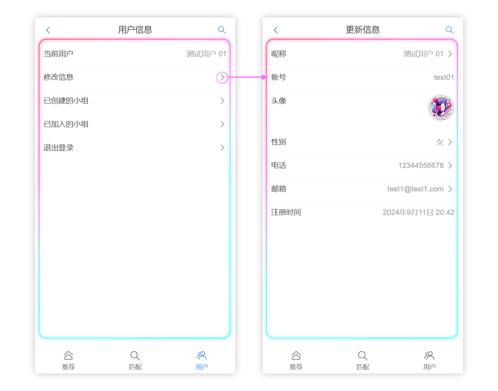

## 项目介绍

为听歌爱好者们设计的在线交友匹配网站！

在这里，用户可以 **将喜欢的音乐风格作为标签** 加入到个人信息中。之后系统将会为你提供：

- 按标签推荐相似用户功能

- 主动检索目标标签用户功能
- 在线建立 / 加入音乐小组功能

👉 点击 [这里](https://partner.asnpro.icu) 可以在线体验该系统！（推荐使用 **移动端** 访问）

❗ 本仓库包含该项目的完整 **前端** 代码

## 技术选型

- [Vue 3](https://vuejs.org/) 
- [Vue-Router](https://router.vuejs.org/) 
- [Axios](https://axios-http.com/) 
- [Vant](https://vant-ui.github.io/vant/v3/#/zh-CN) 
- [Vite](https://vitejs.dev/) 

## 项目展示

推荐首页



音乐小组



用户管理



## 依赖安装

本项目使用 yarn 作为包管理工具，如果你对该项目感兴趣，在将源代码克隆到本地后，可以使用如下指令安装依赖：

```bash
yarn
```

然后，你可以使用如下指令启动项目：

```bash
yarn run dev
```

打包项目的指令为：

```bash
yarn run build
```
